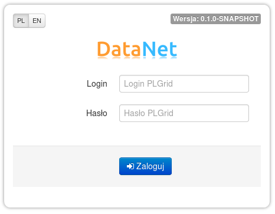
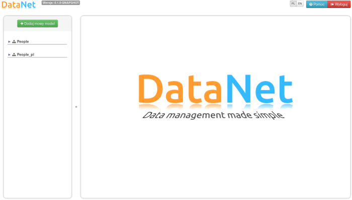
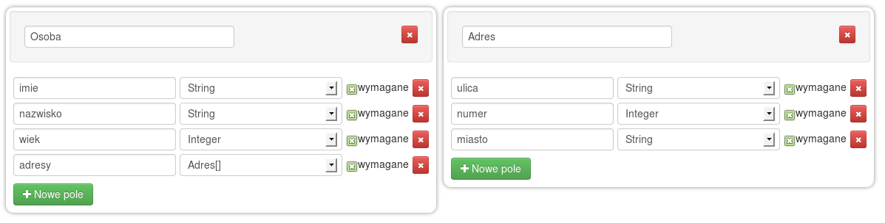
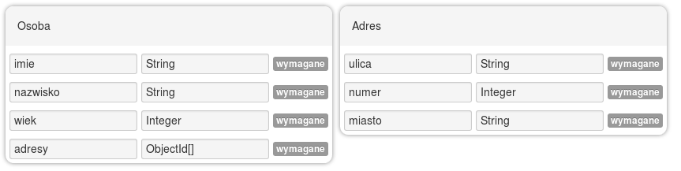
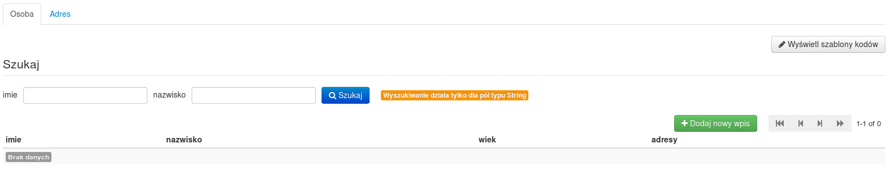
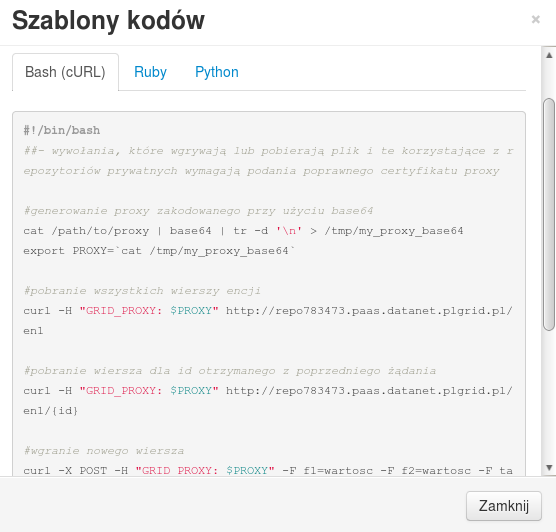

## Instrukcja użytkownika DataNet

### Wprowadzenie

DataNet jest platformą służącą do zarządzania modelami metadanych oraz danych i do udostępniania repozytoriów za pomocą których gromadzone
dane mogą być współdzielone. Poniższe sekcje zawierają opis platformy prezentując rownież stosowne zrzuty obrazów dostępnych interfejsów
użytkownika. Jeśli chcesz zapoznać się z platformą podążając krok po kroku według instrukcji przejdź do [sekcji z tutorialem](../tutorial/).

Główny interfejs użytkownika staje się dostępny po pomyślnym zalogowaniu się poprzez użycie ważnego loginu i hasła infrastruktury PLGrid
na ekranie logowania przedstawionym poniżej. 

---

---

Po poprawnym zalogowaniu się wyświetlony zostanie poniższy ekran, chyba że adres URL wskazuje na konkretny zasób
platformy DataNet.

---

---

Główny widok jest podzielony na trzy części. Górny pasek  po lewej stronie zawiera logotyp DataNet wraz
z oznaczeniem aktualnej wersji oraz z prawej strony przyciski przełączania języka, pomocy i wylogowania.
Poniżej, lewa kolumna zawiera widok drzewa z modelami, wersjami i repozytoriami, a główny obaszar zawiera
widok odpowiedni dla pozycji wybranej w drzewie.

### Zarządzanie modelami

Aby użyć platformy DataNet należy najpierw utworzyć model danych. Model danych opisuje strukturę danych
oraz typy poszczególnych pól. Struktura danych jest wyrażana jako zbiór encji składających się z pól. Pola
mogą mieć następujące typy:

* **`String`** - prosty typ tekstowy,
* **`Integer`** - typ liczbowy całkowity,
* **`Float`** - typ liczbowy rzeczywisty,
* **`Boolean`** - typ boolean,
* **`File`** - typ plikowy.

Niektóre z typów posiadają odpowiednik tablicowy, co jest wyrażone poprzez dodatkowe oznaczenie **`[]`**
w nazwie typu. Pole może mieć również typ innej encji, przez co modeluje się zależności pomiędzy encjami.

Aby stworzyć nowy model należy użyć przycisku <button class="btn btn-success"><i class="icon-plus"></i> Dodaj nowy model</button>.
Nowe encje  i pola mogą być stworzone poprzez użycie przycisków <button class="btn btn-success"><i class="icon-plus"></i> Nowa encja</button>
i <button class="btn btn-success"><i class="icon-plus"></i> Nowe pole</button>. Poniżej przedstawiono przykladowy model danych.

---

---

Powyższy model składa się z dwóch encji, które reprezentują osoby i ich adresy. Powiązanie jest zrealizowane za pomocą
pola `adresy` w encji `Osoba`. Zmiany wprowadzone w modelu mogą być zapisane przez użycie przycisku
<button class="btn"><i class="icon-save"></i> Zapisz</button>. Kiedy dany model jest gotowy do udostępnienia należy
go zapisać jako wersję, której nie można modyfikować i która może być udostępniona jako repozytorium.

### Wersje modeli

Wersja danego modelu zachowuje stan, który nie może być zmieniony. Powinna ona być utworzona kiedy dany stan ma być
zapisany lub kiedy należy model udostępnić jako repozutorium. Aby stworzyć nową wersję należy użyć przycisku
<button class="btn"><i class="icon-briefcase"></i> Nowa wersja...</button> i podać jej nazwę w wyświetlonym okienku.
W drzewie zostanie utworzona pozycja reprezentująca nową wersję, a główny widok przełączy się na widok wersji, który
powinien przypominać ten przedstawiony poniżej.

---

---

Widok wersji jest podobny do widoku tworzenia modelu, a różni je brak możliwości wprowadzania modyfikacji
w pierwszym. Dana wersja moża zostać udostępniona jako repozytorium.

### Udostępnienie repozytorium

Po udostępnieniu repozytorium dla konkretnej wersji dostępny staje się fizyczny zasób pozwalający na zapisywanie
żądań z danymi. Repozytorium może być również odpytywane przy użyciu interfejsu REST. Aby stworzyć nowe repozytorium
należy przełączyć się do widoku wersji i użyć przycisku
<button class="btn"><i class="icon-cloud-upload"></i> Udostępnij repozytorium...</button>. W wyświetlonym okienku
należy podać nazwę repozytorium (nazwa będdzie częścią adresu URL wskazującego na repozytorium). Udostępnienie
może zająć chwilę, po czym nastąpi przełączenie do widoku repozytorium podobne do tego przedstawionego poniżej.

---

---

Przedstawione repozytorium jest puste ale można już skonfigurować poziom dostępu poprzez użycie przycisku
<button class="btn"><i class="icon-eye-open"></i> Konfiguracja dostępu...</button>. W wyświetlonym okienku
można ustawić poziom dostępu na publiczny (taki dostęp jest domyślny) lub prywatny.

* **publiczne repozytorium** - dostęp do repozytorium publicznego nie jest w żaden sposób ograniczony i dowolny
klient ma do niego dostęp i może modyfikować jego zawartość,
* **prywatne repozytorium** - dostęp do repozytorium prywatnego jest ograniczony do grupy użytkowników
zdefiniowanych w okienku konfiguracyjnym.

Widok repozytorium udostępnia również narzędzie generujące przykładowe kody w wybranych językach
programowania umożliwiające dostęp do repozytorium. Kod jest specyficzny dla danego repozytorium i jego encji
i może być kopiowany i uruchamiany bez dodatkowych modyfikacji. Aby wyświetlić przykładowe kody
należy użyć przycisku <button class="btn"><i class="icon-pencil"></i> Wyświelt szablony kodów</button>.
Poniżej zamieszczono przykładowy szablon dla języka Bash, pokazujący jak za pomocą polecenia `curl` można uzyskać dostęp do repozytorium.

---

---

### Przeglądanie i filtrowanie danych w repozytorium

W widoku repozytorium każda encja ma dedykowaną zakładkę, gdzie dane mogą być przeglądane, filtrowane i mogą być
dodawane nowe wiersze. Tabela z danymi jest stronicowana i udostępnia informacje o aktualnej stronie i ilości
wszystkich wierszy. Do filtrowania danych udostępniony jest prosty formularz nad tabelą. Obecnie filtrowanie
odbywa się poprzez dokładne dospasowanie dla pól typu tekstowego (więcej możliwości filtrowania udostępnia
interfejs REST). Użycie formularza wyszukiwania jest standardowe. Nowe wiersze mogą być dodawane poprzez
użycie przycisku <button class="btn btn-success"><i class="icon-plus"></i> Dodaj nowy wpis</button>
i uzupełnienie wyświetlonego okienka.

### Przeszukiwanie i dostęp do repozytorium za pomocą interfejsu REST

Interfejs REST danego repozytorium jest interfejsem dostępnym dla aplikacji, którego używa się do zapisania,
filtrowania i aktualizacji danych. Dostęp do repozytorium może być zrealizowany za pomocą jednej z dostępnych
bibliotek REST w danym języku programowania (przykładowo używając interpreter Bash można użyć narzędzia
[cURL](http://curl.haxx.se)). Główny adres repozytorium jest podany w widoku repozytorium w nagłówku głównego
widoku. Podstawowy adres wygląda następująco: `http://{nazwa_repozytorium}.datanet.cyfronet.pl`. Żadanie
wysłane na ten adres zwróci listę encji modelu dla danego repozytorium. Poniżej znajduje się lista pozostałych
żądań, które mogą być wysłane do repozytroium.

* **`GET http://{nazwa_repozytorium}.datanet.cyfronet.pl/{nazwa_encji}`**

    Zwraca listę identyfikatorów wszystkich wierszy danej encji. Nazwa encji może zostać pobrana z listy zwróconej
    po wejściu na adres podstawowy repozytorium.

* **`GET http://{nazwa_repozytorium}.datanet.cyfronet.pl/{nazwa_encji}.schema`**

    Zwraca dokument w formacie JSON opisujący daną encję.

* **`GET http://{nazwa_repozytorium}.datanet.cyfronet.pl/{nazwa_encji}/{id}`**

    Zwraca pojedynczy wiersz encji. Parametr `id` jest elementem listy zwróconej przez poprzednie żądanie.

* **`GET http://{nazwa_repozytorium}.datanet.cyfronet.pl/{nazwa_encji}/{id}/{nazwa pola}`**

    Zwraca wartość danego pola.

* **`POST http://{nazwa_repozytorium}.datanet.cyfronet.pl/{nazwa_encji}`**

        Content-Type: multipart/form-data #jeśli wgrywane są pliki ...
        Content-Type: application/x-www-form-urlencoded #jeśli wgrywany jest zwykły formularz bez plików
        #zawartość żądania POST ...

    Wysłanie żądania metodą POST na przedstawionym adresie URL stworzy nowy wiersz encji i uzupełni pola
    wartościami przesłanymi w żądaniu. Takie żądanie jest zgodne ze standardowym wysłaniem formularza
    na stronie internetowej. Jeśli nie są wgrywane pliki można użyć alternatywnego żądania wykorzystującego
    format danych JSON do stworzenia nowego wiersza encji. W takim przypadku zawartość żądania powinna
    wyglądać następująco:
    
        Content-Type: application/json
        {
            "pole_tekstowe": "wartosc",
            "pole_liczbowe": 42,
            "tablica_tekstowa": ["wartosc1", "wartosc2"],
            "tablica_liczbowa": [42, 68]
        }

    Nazwy pól powinny być zgodne z nazwami w modelu danych. Rezultatem takiego żądania jest identyfikator
    nowo utworzonego wiersza encji.

* **`PUT http://{nazwa_repozytorium}.datanet.cyfronet.pl/{nazwa_encji}/{id}`**

    Aby zmodyfikować istniejący wiersz encji, należy wysłać żądanie typu PUT. Składnia takiego żądania
    jest taka sama jak przy użyciu metody POST opisanej powyżej.

Filtrowanie danej encji może zostać zrealizowane za pomocą części adresu URL odpowiadającej zapytaniu. Na przykład,
jeśli encja ma pole typu `String` nazwane `nazwisko` żądanie zwracające tylko wiersze z nazwiskiem `Kowalski` powinno
wyglądać następująco: `http://{nazwa_repozytorium}.datanet.cyfronet.pl/{nazwa_encji}?nazwisko=Kowalski`. Inne
wspierane operatory przedstawiono poniżej.

* **operatory numeryczne**: `<`, `<=`, `>`, `>=`, `!=`

    Jesli dane pole jest typu `Integer` lub `Float` można użyć powyższych operatorów.

* **operatory tekstowe**: `=`, `/regexp/`

    Beside the exact match operator `=` a regular expression can be used for querying text fields. The query part
    using a regular expression should look like this: `...&text_field=/reg_exp/&...`.
    
    Oprócz operatora dokładnego dopasowania `=` można użyć wyrażenia regularnego do filtrowania pól tekstowych.
    Zzapytanie używające takich wyrażeń powinno wyglądać następująco: `...&pole_tekstowe=/wyr_reg/&...`.

* **operatory kolekcji**: `wartosc1,wartosc2`

    W przypadku gdy pole jest typu tablicowego można podać listę wartości w celu porównania z zapisanymi danymi.
    W takim przypadku wiersz encji zostanie zwrócony tylko wtedy jeśli zapisana tablica zawiera wszystkie
    przekazane wartości. Przykładowa część zapytania powinna wyglądać następująco:
    `...&tablica_numeryczna=45,34,98&...`.
    
* **złożone zapytania**: `>20` & `<=30`
	W przypadku, gdy chcemy stworzyć bardziej złożone zapytanie, gdzie pojedynczy atrybut powinien spełniać kilka warunków możemy
	skorzystać ze złożony zapytań. Tworzymy je podobnie jak w przykładach opisanych powyżej, z tą różnicą, że po nazwie atrybutu dodajemy
	`[]`. Dzięki takiemu zakodowaniu parametrów do repozytorium przekazywana jest tablica warunków dla danego atrybutu. Przykładowe zapytanie 
	może wyglądać następująco: `...&wiek[]=>20&wiek[]=<=30...`. W rezultacie zostaną zwrócone wszystkie rekordy, w których `wiek` znajduje 
	się w przedziale `(20, 30]`. 
