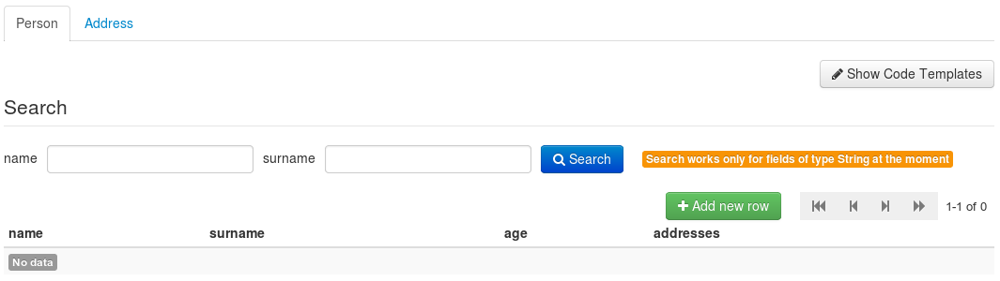

## DataNet User Manual

### Introduction

DataNet is a platform for managing metadata and data models and deploying corresponding data repositories for collecting and sharing the data.
The following sections describe the process presenting corresponding screenshots of the available user interface. If you wish to learn to use
the platform by following a step-by-step tutorial please go to the [tutorial section](../tutorial/).

The interface becomes available after a successful login procedure by providing valid PLGrid credentials in the login screen presented below.

---

---

After a successful login action the following welcome screen should be rendered unless the URL
points to a concrete DataNet resource.

---

---

The main screen is divided into three sections. The top header contains DataNet logo with current
version on the left and language switch, help and logout buttons on the right. Below, the left column
contains a tree of models, versions and repositories and the main area shows views specific to the item
chosen in the tree.

### Model management

In order to use the DataNet platform a data model needs to be created. A data model shows how the stored
data are structured and what is the type of individual fields. Data structure can be expressed as a set
of entities consisting of fields. Fields can be of the following types:

* **`String`** - simple text type,
* **`Integer`** - integer type,
* **`Float`** - float type,
* **`Boolean`** - boolean type,
* **`File`** - file type.

Some of the types have an array equivalent in which case the type name is followed by **`[]`**. Also,
a field can have a type of another entity if a relationship should be modeled.

To create a new model the <button class="btn btn-success"><i class="icon-plus"></i> Add new model</button> button should be clicked.
Afterwards, new entities and fields can be added by using the <button class="btn btn-success"><i class="icon-plus"></i> New entity</button>
and <button class="btn btn-success"><i class="icon-plus"></i> New field</button> buttons respectively. A sample
model is given below.

---

---

The model consists of two entities representing people and their addresses. The relationship is done through
the `addresses` field in the `Person` entity. After applying any modifications to the model it can be saved
by clicking the <button class="btn"><i class="icon-save"></i> Save</button> button. When a given model is ready
to be published it can be stored as a version which cannot be modified and only a model version can be deployed
as a repository.

### Model versions

A version of a given model is a snapshot which cannot be modified. It should be created when you want to ensure
that a certain state of the model should be saved or when it should be made available as a repository. To create
a new version click the <button class="btn"><i class="icon-briefcase"></i> New version...</button> button
and provide its name in the displayed popup window. A tree item representing the new version will be created
and the main view will switch to the version view which should be similar to the one below.

---

---

The version view is similar to the model creation view with the exception that it does not provide means
to modify the model. A given version can be deployed to expose a repository.

### Repository deployment

After a repository for a particular version is deployed a physical resource is made available to store incoming
data requests. The repository later can be queried for stored data by using a REST endpoint. To create a new
repository switch to a version view by clicking one of the model versions in the model tree and click the
<button class="btn"><i class="icon-cloud-upload"></i> Deploy repository...</button> button. In the presented
popup provide the repository name (the name will be a part of the URL pointing to it). The deployment may take
some time and afterwards you will be switched to the repository view similar to the one below.

---

---

For now the repository is empty but you can already configure its access restrictions by clicking the
<button class="btn"><i class="icon-eye-open"></i> Access configuration...</button> button. In the popup
you can set the repository to be public (this is the default) or private.

* **public repository** - access to public repositories is not limited at all, any party can access and modify
its contents,
* **private repository** - access to private repository is limited to a group of users defined in the configuration
popup.

The repository view also provides a utility which generates code samples in a few programming languages giving
access to the repository. The code is specific for a given repository and its entities and can be copied
and executed straight away. To access the utility click the
<button class="btn"><i class="icon-pencil"></i> Show code templates</button> button.

### Repository data browsing and filtering

In the repository view each entity has a dedicated tab where the data can be browsed and queried and new
records can be added. The data table provides pagination with indication of the current page and the number
of all items. In order to search the data a simple form is available above the table. Currently, only exact
matching for string fields is available (more search options are offered by the REST API). The use of the search
form should be straightforward. New records can be added bby clicking the
<button class="btn btn-success"><i class="icon-plus"></i> Add new row</button> button and providing the data
in the presented popup.

### Repository REST interface access and querying

The REST interface of a repository is the interface exposed to applications used for storing, querying and
updating data. Access to the repository can be accomplished by using one of the available libraries
in a given programming language (for instance when using Bash the [cURL](http://curl.haxx.se) tool can be used).
The main URL of the repository is given in the repository view in the header of the main view. The base URL looks
like this: `http://{repository_name}.datanet.cyfronet.pl`. When accessed the response will contain a list of
entities for the repository's model. Below is a list of other requests that can be invoked on a repository.

* **`GET http://{repository_name}.datanet.cyfronet.pl/{entity_name}`**

    Returns a list of identifiers of all entity rows. Entity name can be one from the list returned by entering
    the base URL of the repository.

* **`GET http://{repository_name}.datanet.cyfronet.pl/{entity_name}.schema`**

    Returns a JSON schema document describing a given entity.

* **`GET http://{repository_name}.datanet.cyfronet.pl/{entity_name}/{id}`**

    Returns a single row of an entity. The `id` parameter is one from the list obtained by the previous
    method.

* **`GET http://{repository_name}.datanet.cyfronet.pl/{entity_name}/{id}/{field_name}`**

    Returns a value of a given field.

* **`POST http://{repository_name}.datanet.cyfronet.pl/{entity_name}`**

        Content-Type: multipart/form-data #when uploading files or ...
        Content-Type: application/x-www-form-urlencoded #when storing plain form without files
        #POST body follows...
    
    A POST method requested on the given URL will store a new entity row and fill in the field values
    sent in the request. This is compliant with a standard web form submission. When not uploading files
    an alternative JSON notation can be used to store an entity. In this case the request body should look
    like this:
    
        Content-Type: application/json
        {
            "string_field": "value",
            "number_field": 42,
            "array_string_field": ["value1", "value2"],
            "array_number_field": [42, 68]
        }
    
    Names of the fields should correspond to those defined in the model. The result of such request is
    an identifier of a newly created entity row.

* **`PUT http://{repository_name}.datanet.cyfronet.pl/{entity_name}/{id}`**

    In order to modify an existing entity row a PUT  request should be invoked. The syntax of  the request body
    is the same as with the POST request described above.

Querying a given entity can be accomplished by using the query part of a URL pointing to an individual entity. For
instance if an entity has a `String` field named `surname` a request returning only rows with a surname of value
`Smith` would look like this: `http://{repository_name}.datanet.cyfronet.pl/{entity_name}?surname=Smith`.
The supported operators are listed below.

* **number operators**: `<`, `<=`, `>`, `>=`, `!=`

    If a field is of type `Integer` or `Float` the listed operators can be used.

* **text operators**: `=`, `/regexp/`

    Beside the exact match operator `=` a regular expression can be used for querying text fields. The query part
    using a regular expression should look like this: `...&text_field=/reg_exp/&...`.

* **collection operators**: `value1,value2`

    In case a field has an array type a list of values can be given to match the stored contents. In such case
    an entity row will be returned only if the stored array contains all of the passed values. A sample query
    part could look like this: `...&array_number_field=45,34,98&...`.
    
* **complex queries**: `>20` & `<=30`
	In case when attribute should fulfill complex query conditions you can pass conditions array encoded into 
	query parameters. It is done by adding `[]` at the end of attribute name. E.g. when you want to return all
	records for user entity, where user is in age higher than 20 and not higher than 30 than you can use following
	query params: `...&age[]=>20&age[]=<=30...`
