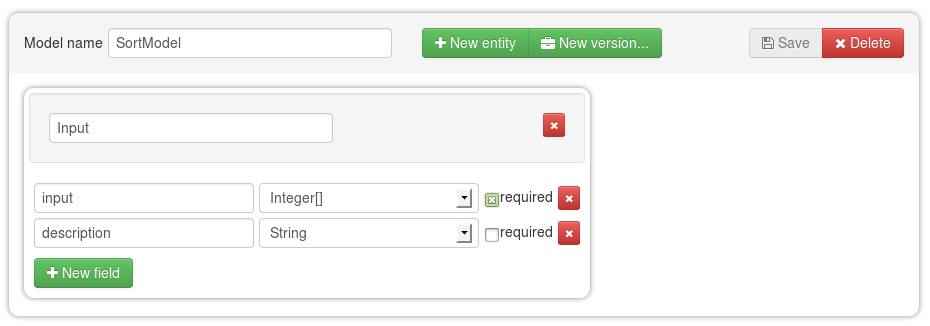
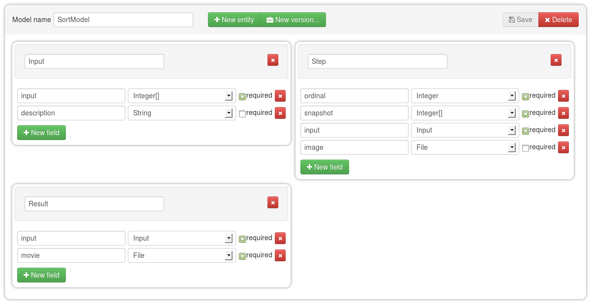
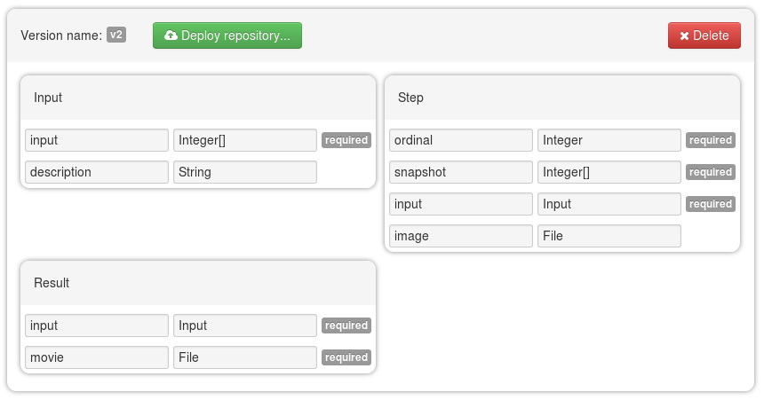
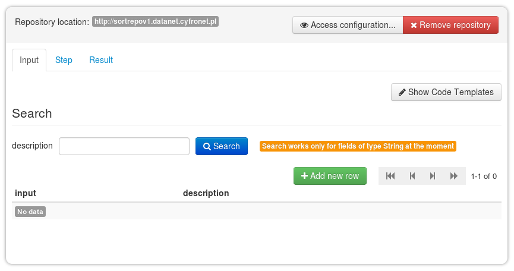

## DataNet Tutorial

### Introduction

The tutorial will guide you through the process of creating a data model and storing data for visualizing a sorting
algorithm. We will use the insertion sort algorithm and remember all the intermediary steps to be combined
in a final movie in the end. As the execution platform we will use the [GridSpace](https://gs2.plgrid.pl) platform.

### Data model

For our sorting experiment we want to store input number series and the final sorting visualization movie,
but also, all the intermediary sorting steps. We will use a model consisting of three entities with
relationships. Follow the steps below to accomplish this task.

1. Login to DataNet [here](../../) (you will have to have a valid PLGrid account).

2. Create a new model by clicking the <button class="btn btn-success"><i class="icon-plus"></i> Add new model</button> and change its name in the *Model name* field
   to your liking.

3. Create a new entity by clicking the <button class="btn btn-success"><i class="icon-plus"> New entity</i></button> button and name it *Input*.

4. With the <button class="btn btn-success"><i class="icon-plus"> New field</i></button> button add a field named *input* and set its type to *Integer[]*
   (this type represents an array of integers).

5. Add another field named *description*, leave its type as *String* and deselect the *required* flag.

6. Save the model by using the <button class="btn"><i class="icon-save"> Save</i></button> button.

    The model should look more or less the same as in the figure below.

    

7. Add two more entities with fields according to the structure below.

    * entity with name **Step** and fields:
        * required field with name **ordinal** and type **Integer** - this will hold the step number
        * required field with name **snapshot** and type **Integer[]** - this will hold the sorted sequence at a given step
        * required field with name **input** and type **Input** - this will reference the *Input* entity
        * not required field with name **image** and type **File** - this will hold the image of the sorted sequence being one frame of the final movie
    * entity with name **Result** and fields:
        * required field with name **input** and type **Input** - this will reference the *Input* entity
        * required field with name **movie** and type **File** - this will hold the final movie

8. Save the model which should resemble the one below now.

    

### Creating a version and deploying the repository

When a data model is ready a version should be created to store an unmodifiable snapshot of the model and later
deploy the version as a working repository. To do that follow the steps below.

1. Select the sort model from the tree in the column on the left and use the
   <button class="btn btn-success"><i class="icon-briefcase"> New version...</i></button> button to create
   a new version.

2. In the popup window enter the name of the new version (e.g. *v1*) and click the
   <button class="btn btn-primary"><i class="icon-briefcase"> Create version</i></button> button.

    The step will create a new version and the main view will be switched to version view. The view resembles
    the model creation view with the difference that the model cannot be modified. It should be similar to the snapshot
    below.
    
    

3. In the version view click the <button class="btn btn-success"><i class="icon-cloud-upload"> Deploy repository...</i></button>
   button to deploy the repository.

4. In the displayed popup fill in the repository name (e.g. *sortrepo*) and confirm the operation by clicking the
   <button class="btn btn-primary"><i class="icon-file"> Deploy</i></button> button.

    The deployment may take some time so be patient. Note that the provided repository name will be a part of the URL pointing
    to the repository. After the deployment is finished you will be taken to the repository view where you can see the full
    URL of the repository, configure its access policy (by default the repository is public), look at a few code templates
    showing how to access the repository and take a peek at the data stored in it for each of the entities (for now the
    repository will be empty). For reference the repository view snapshot is given below.
    
    

### Execution of the sorting code

The code which will submit data to the repository will be executed on the GridSpace platform. In order to use the platform
you need a valid PLGrid account, access to one of the PLGrid infrastructures and a sorting experiment. Follow the steps
below to accomplish this task.

1. Download a sorting experiment to your local machine from [here](resources/sorting-experiment.exp.xml).

2. Make sure you have access to one of the PLGrid computing infrastructures by checking your services in the
   [PLGrid portal](https://portal.plgrid.pl).

3. Login to GridSapce Experiment Workbench through [this page](https://gs2.plgrid.pl) by clicking the *Login »* button.

4. By using the *Upload file* button in the *Files* panel upload the experiment saved in the first step.

5. Open the experiment by clicking it in the *Files* panel.

    You should see three main code snippets which generate a random number sequence (Ruby), sort the sequence storing individual
    steps (Python) and produce the final movie (Bash job). Each of the codes
    accesses the remote DataNet repository to store or retrieve relevant data. The first snippet is used to distribute repository
    URL among other snippets.

6. Update your repository location inside first code snippet

7. Execute individual code snippets starting from the first one and observe the data table in the repository view for each of 
   the entities (you can refresh the view by refreshing the whole page). The data table should be filled in with data. The final
   movie can be downloaded from the *Result* entity table.